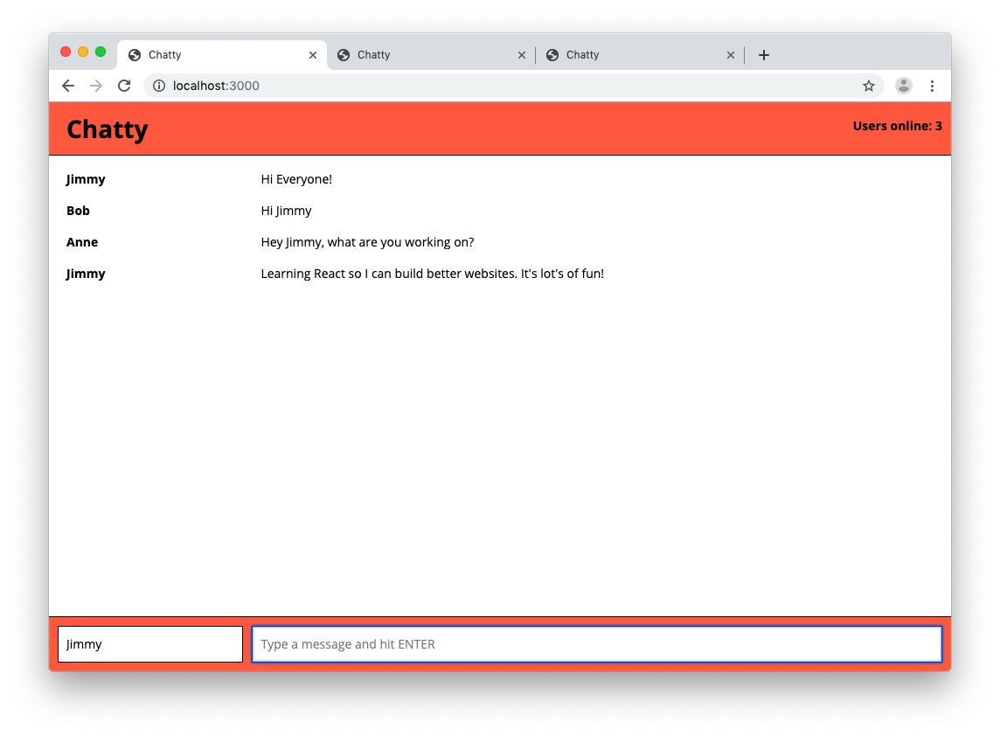
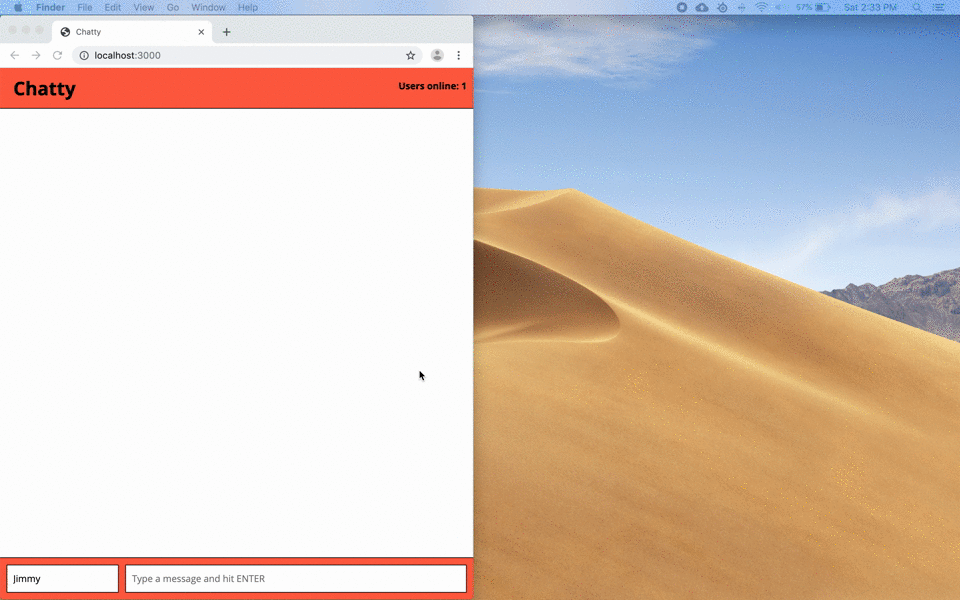

# Chatty App

Chatty is a single page application (SPA) that provides real-time communication between all connected clients, similar to a [Slack](https://slack.com/intl/en-ca/) channel. 

### Front-end:
The html content is rendered on the client side using the [ReactJS](https://reactjs.org/) framework/library. React allow the developer to create the interactive parts of the app in JavaScript and render the html  needed as well as change the html elements quickly making the app dynamic. [Sass](https://sass-lang.com/) is used to style the html elements. 

The front-end JavaScript and html is written in the JSX file type and is later transpiled by [babel-loader](https://webpack.js.org/loaders/babel-loader/)/[babel](https://babeljs.io/) from ES6 to ES5. [webpack](https://webpack.js.org/) then assembles/bundles the SCSS and JSX files into JavaScript and CSS to be used by the client.

### Back-end:
The back-end server is built using [node.js](https://nodejs.org) and [Express.js](https://expressjs.com/) - a node.js framework. The client-side app communicates with the server via the WebSockets communication protocol for multi-user, real-time comminication. WebSocket is what allows real-time communication to take place, client actions are sent to the server and the server broadcasts the incoming notifications and messages to all the active clients. This is possible due to the duplex (two-way) communication over a single TCP connection.

## Screenshot & video:







## Getting started

In order to use  Chatty App, you must first clone the project to your local machine.

Once the project is cloned, head over to your bash terminal and install the dependencies (listed below) using the following command:

```
npm install
```

Once all the dependencies are installed, type the following command to get the server started:

```
npm start
```

You should see a message in terminal saying:
```
Running at http://0.0.0.0:3000
```

Now head over to your web browser and navigate to <strong><localhost:3000></strong> and start chatting away!

## Dependencies

These are the modules needed to run Chatty:

- [node.js](https://nodejs.org)
- [express](https://www.npmjs.com/package/express)
- [react-dom](https://www.npmjs.com/package/react-dom)
- [uuid](https://www.npmjs.com/package/uuid)
- [ws](https://www.npmjs.com/package/ws)